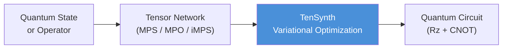
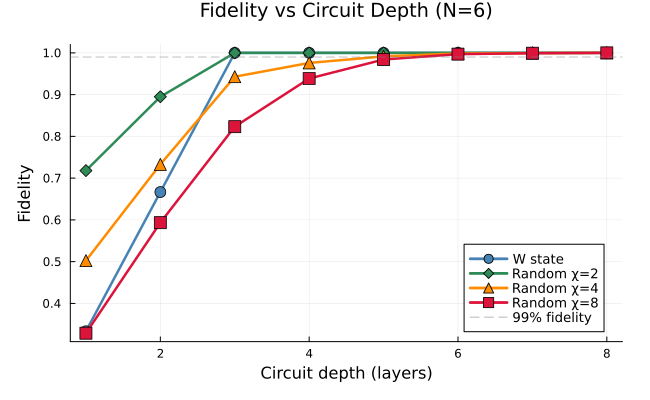
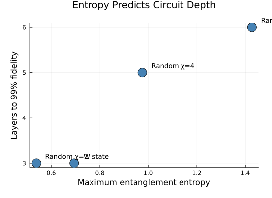
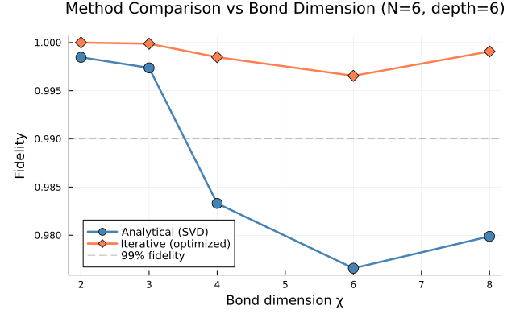

# TenSynth.jl

**Compile quantum states and operators into quantum circuits using tensor networks.**

TenSynth provides variational and analytical methods for synthesising quantum circuits from Matrix Product States (MPS), Matrix Product Operators (MPO), and infinite MPS (iMPS) representations. It targets near-term circuit compilation problems where entanglement structure determines circuit depth.



## Showcase

**States with more entanglement need deeper circuits — and TenSynth finds the optimal compilation.**

<p align="center">
  
  &nbsp;&nbsp;
  
</p>

<p align="center">
  <em>Left:</em> Circuit fidelity improves with depth; higher bond dimension (more entanglement) requires more layers.
  <em>Right:</em> Maximum entanglement entropy directly predicts the number of layers needed for 99% fidelity.
</p>

<p align="center">
  
</p>

<p align="center">
  <em>Iterative variational optimization consistently outperforms analytical SVD decomposition, especially at high bond dimension.</em>
</p>

## Quick Start

```julia
using TenSynth
using TenSynth.MPS

# Create a random 6-qubit MPS with bond dimension 4
mps = randMPS(6, 4)

# Compile to a quantum circuit
result = decompose(mps; method=:iterative, max_layers=5)

println("Fidelity: ", round(result.fidelity, digits=6))
println("Gates:    ", result.n_gates, " two-qubit + single-qubit layers")

# Export to OpenQASM
qasm = to_qasm(result)
```

## Features

- **MPS state compilation** — analytical (SVD), iterative (variational), and layer-addition protocols
- **MPO unitary compilation** — Hilbert–Schmidt test cost optimization for time-evolution operators
- **Infinite MPS** — ground state preparation and unitary compilation via iTEBD
- **Hamiltonians** — TFIM, Heisenberg, XY, XXZ with 1st/2nd/4th-order Trotter decomposition
- **Circuit topologies** — staircase and brickwork layouts with configurable depth
- **Clifford+T synthesis** — optional GridSynth / TraSynth integration via PyCall

## Modules

| Module | Description |
|--------|-------------|
| `TenSynth.Core` | Gate constants, parameterizations, linear algebra utilities |
| `TenSynth.MPS` | Finite MPS → circuit (decompose, compile, optimize) |
| `TenSynth.MPO` | MPO unitary → circuit (HST cost optimization) |
| `TenSynth.iMPS` | Infinite MPS ground states & unitary compilation |
| `TenSynth.Hamiltonians` | Spin chain Hamiltonians and Trotterization |

## Example Notebooks

| # | Notebook | Topic |
|---|----------|-------|
| 1 | [Getting Started](examples/01_getting_started.ipynb) | MPS basics, three decomposition methods, QASM export |
| 2 | [Entanglement & Depth](examples/02_entanglement_and_circuit_depth.ipynb) | Why entanglement determines circuit depth |
| 3 | [DMRG Ground States](examples/03_dmrg_ground_states_to_circuits.ipynb) | TFIM ground states across the phase transition |
| 4 | [MPO Compilation](examples/04_mpo_unitary_compilation.ipynb) | Time-evolution operator compilation |
| 5 | [Hamiltonians & Trotter](examples/05_hamiltonians_and_trotter.ipynb) | Four spin models, Trotter error scaling |
| 6 | [iMPS Ground States](examples/06_imps_ground_states.ipynb) | iTEBD convergence, infinite state preparation |
| 7 | [iMPS Unitaries](examples/07_imps_unitary_compilation.ipynb) | Infinite unitary compilation with train/test splits |
| 8 | [Clifford+T Synthesis](examples/08_clifford_t_synthesis.ipynb) | Fault-tolerant T-gate resource counting |

## Installation

```julia
using Pkg
Pkg.add(url="https://github.com/GibbsJR/TenSynth.git")
```

Requires **Julia 1.10+**.

## Tests

```julia
using Pkg
Pkg.test("TenSynth")
```

Runs 476 tests across all modules (Core, MPS, MPO, iMPS, Hamiltonians, integration).
